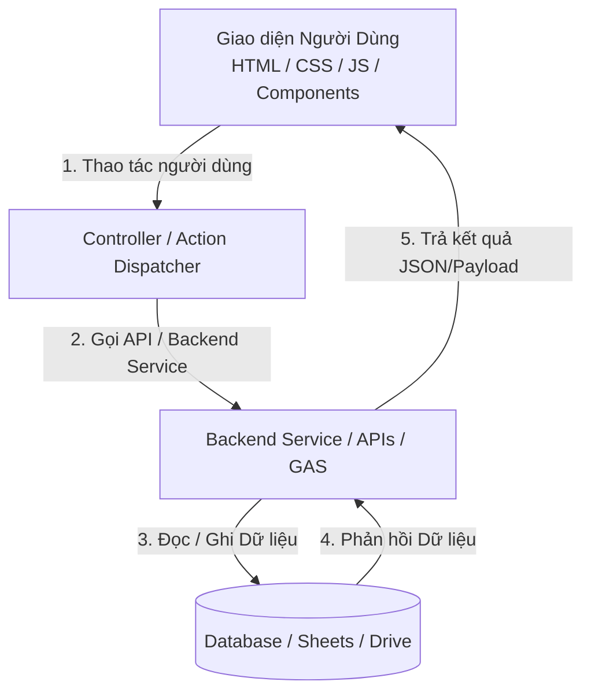

# Bản Đồ Kiến Trúc & Schematic (App AP CAR CARE)

> 📍 **Mục đích:** File này là kim chỉ nam về kiến trúc tổng thể, luồng dữ liệu và tọa độ hàm của app. Phục vụ đắc lực cho quy trình **Chống lặp lại sửa sai (Debugging Protocol)**. Bất cứ khi nào Agent gặp bế tắc (i = 3), BẮT BUỘC phải mở file này ra đối chiếu luồng dữ liệu để tìm hướng tiếp cận rẽ nhánh.

---

## 🧭 QUY TẮC CẬP NHẬT FILE NÀY

- **Tự động cập nhật KHI:** Task yêu cầu thay đổi cấu trúc hệ thống, thay đổi luồng giao tiếp dữ liệu giữa Frontend - Backend / Database, hoặc thêm module/tính năng lớn mới. Agent BẮT BUỘC phải cập nhật file này sau khi hoàn tất task.
- **BỎ QUA cập nhật KHI:** Task chỉ liên quan đến sửa đổi UI/UX lặt vặt, fix bug hiển thị frontend, chỉnh sửa text/css không làm ảnh hưởng đến logic luồng dữ liệu cốt lõi.

---

## 1. MÔ HÌNH KIẾN TRÚC TỔNG THỂ (LOGISTICS SCHEMATIC)

*(Sơ đồ mẫu Mermaid sẽ được cập nhật cụ thể khi xác định tech-stack và luồng dữ liệu của app)*

---

## 2. CÁC TRỤ CỘT KỸ THUẬT & NGUYÊN TẮC THIẾT KẾ

1. **Single Source of Truth (SSOT):** Toàn bộ state/data có một nguồn quản lý tập trung, tránh phân tán gây lệch dữ liệu.
2. **FIELD_MAP Pattern (Bắt buộc):** Ánh xạ cấu trúc dữ liệu bảng / database ra Frontend Object, không hardcode index cột.
3. **Optimistic UI & Feedback:** Phản hồi giao diện tức thì cho người dùng khi thao tác, xử lý đồng bộ nền an toàn.
4. **Data Isolation & Clean Code:** Tách bạch rõ ràng giữa tầng Render giao diện và tầng Xử lý logic / Gọi API.

---

## 3. BẢN ĐỒ MODULE & TỌA ĐỘ FILE CODE CHÍNH

### 3.1. Frontend Modules (`src/`)
| File / Component | Chức năng chính | Hàm / Biến quan trọng |
|---|---|---|
| *(Sẽ cập nhật khi có code)* | | |

### 3.2. Backend / API / Database (`src/`)
| Module / File | Vai trò | Điểm kết nối dữ liệu |
|---|---|---|
| *(Sẽ cập nhật khi có code)* | | |

---

## 4. TỌA ĐỘ HÀM VÀ TRẠNG THÁI (STATE MAP)
*(Danh mục các hàm điều phối trọng yếu trong app sẽ được cập nhật khi xây dựng tính năng)*
